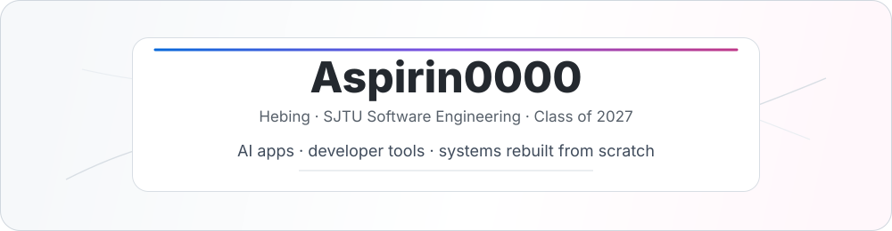

  

  <code>AI products</code> &nbsp; <code>systems from scratch</code> &nbsp; <code>Go / C++ / TypeScript</code>

 

## Featured

<table>
  <tr>
    <td valign="top">
      <h3>合乎周礼 / Zhouli Translator</h3>
      
AI-era Chinese style translator: prompt craft, image export, Cloudflare deploy.

      

        <a href="https://github.com/Aspirin0000/zhouli-translator">repo</a> ·
        <a href="https://hehuzhouli.com">live</a>
      

    </td>
  </tr>
</table>

## Stack

  
  
  
  
  
  
  

## GitHub Activity

  
  

---

  Learning by rebuilding. Shipping quietly.

