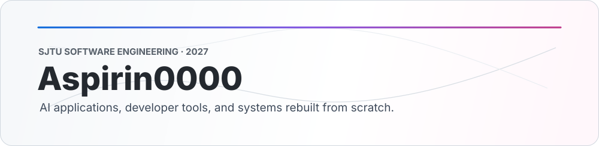
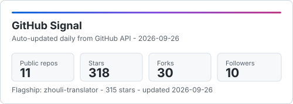
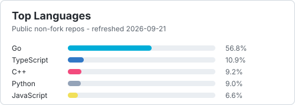

  

  
  
  
  

## About Me

**Hi, I'm Hebing** — I build reliable systems with a system-first mindset.  
I’m a Software Engineering undergraduate at **SJTU (2027)**, focused on backend systems, API design, and deployment.

**Core strengths:** architecture design, requirements modeling, clean interfaces, scalable data flow.  
**Technical base:** C++ / Go / TypeScript, with practical AI + frontend integration experience.  
**Featured:** `合乎周礼` — AI-era Chinese translator with production-minded delivery. Current impact: **1.2m+ video plays**, **471k+ page views**, **76k+ likes**.

## Tech I Use

  
  
  
  
  
  
  
  
  
  
  
  
  
  
  
  
  
  ...  

  

  
  

---

  Learning by rebuilding. Shipping quietly.

