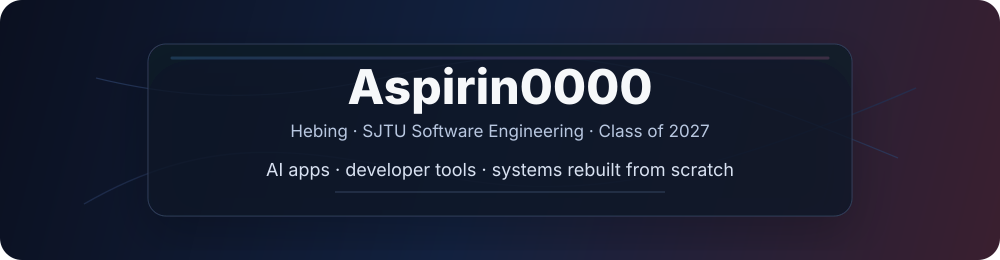

  

  
  
  

  Building AI apps, developer tools, and small systems that are easier to understand than they were to invent.

  <code>AI products</code> &nbsp; <code>systems from scratch</code> &nbsp; <code>Go / C++ / TypeScript</code>

 

## Featured

<table>
  <tr>
    <td width="50%" valign="top">
      <h3>合乎周礼</h3>
      
AI-era Chinese style translator. Prompt craft, product surface, rate limits, image export, and Cloudflare deploy in one shipped app.

      

        <a href="https://github.com/Aspirin0000/zhouli-translator">repo</a> ·
        <a href="https://hehuzhouli.com">live</a>
      

    </td>
    <td width="50%" valign="top">
      <h3>vllm-from-scratch</h3>
      
Rebuilding LLM serving ideas from first principles: KV cache, block management, scheduling, and the shape of fast inference.

      

        <a href="https://github.com/Aspirin0000/vllm-from-scratch">repo</a> ·
        learning log
      

    </td>
  </tr>
</table>

  <a href="https://github.com/Aspirin0000/claude-code-go">claude-code-go</a> ·
  <a href="https://github.com/Aspirin0000/mySTL">mySTL</a> ·
  <a href="https://github.com/Aspirin0000/QBasic">QBasic</a> ·
  <a href="https://github.com/Aspirin0000/QLink">QLink</a>

## Stack

  
  
  
  
  
  
  

## GitHub Activity

  
  

---

  Learning by rebuilding. Shipping quietly.

