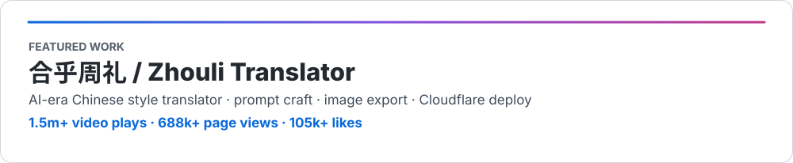

  

## About Me

Hi, I'm Hebing — I build **reliable software with a system-first mindset**.  
I’m a Software Engineering undergraduate at **SJTU (2027)**, focused on backend systems, API design, and deployment.

- **Core strengths**: system architecture, requirements modeling, clean interfaces, scalable data flow.  
- **Technical stack**: C++ / Go / TypeScript with practical AI + frontend integration experience.  
- **Featured work**: `合乎周礼` — turning AI translation ideas into a production-friendly product.

 

## Tech I Use

  
  
  
  
  
  
  
  
  
  
  

 

  

 

  
  

---

  Learning by rebuilding. Shipping quietly.

