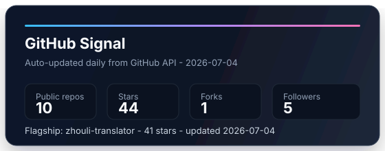
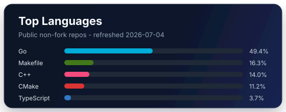

  

  
  
  
  

<h3 align="center">Software Engineering undergraduate at Shanghai Jiao Tong University</h3>

  I build small systems to understand how real software behaves: AI applications, developer tooling,
  backend services, and lower-level C++/Go internals.

---

## Current Focus

- Building AI-era applications where product surface, prompt design, runtime behavior, and deployment all matter.
- Rebuilding core abstractions from scratch: containers, interpreters, command-line tools, and web services.
- Strengthening systems and backend fundamentals with C++, Go, TypeScript, and Linux-based tooling.

## Selected Work

| Project | What it shows | Stack |
| --- | --- | --- |
| [合乎周礼 / Zhouli Translator](https://github.com/Aspirin0000/zhouli-translator) | A public AI web app that turns everyday Chinese into a formal, ritual-style "Zhouli" voice. Includes DeepSeek generation, prompt shaping, rate limiting, image card export, Cloudflare deployment, and a distributable Skill package. [Live](https://hehuzhouli.com) | Next.js, TypeScript, React, DeepSeek, Cloudflare Workers |
| [vllm-from-scratch](https://github.com/Aspirin0000/vllm-from-scratch) | A learning roadmap for rebuilding vLLM-style PagedAttention ideas from first principles, including KV cache design, block management, scheduling, and benchmarking goals. | LLM systems, PagedAttention, CUDA roadmap |
| [claude-code-go](https://github.com/Aspirin0000/claude-code-go) | A Go rebuild of the Claude Code CLI, focused on developer tooling and command-line engineering. | Go, CLI tooling |
| [mySTL](https://github.com/Aspirin0000/mySTL) | Self-built versions of C++ containers including vector, list, priority queue, and map based on a red-black tree. | C++, data structures |
| [QBasic](https://github.com/Aspirin0000/QBasic) | A Qt-based BASIC interpreter toy project, covering parsing, runtime behavior, and desktop UI. | Qt, C++, Makefile |
| [QLink](https://github.com/Aspirin0000/QLink) | A Qt/CMake RPG-style link game project, useful for practicing application structure and UI logic. | Qt, CMake, C++ |

## Engineering Interests

- AI applications that are small, useful, and actually shipped.
- Developer tools that make complex workflows feel direct.
- Runtime behavior, correctness, and maintainable system boundaries.
- C++ internals, Go tooling, backend engineering, and practical deployment.

## Tech I Use

  
  
  
  
  
  
  
  
  
  
  

## GitHub Activity

  
  

---

  Learning by rebuilding. Shipping when possible. Keeping the interface smaller than the idea behind it.

